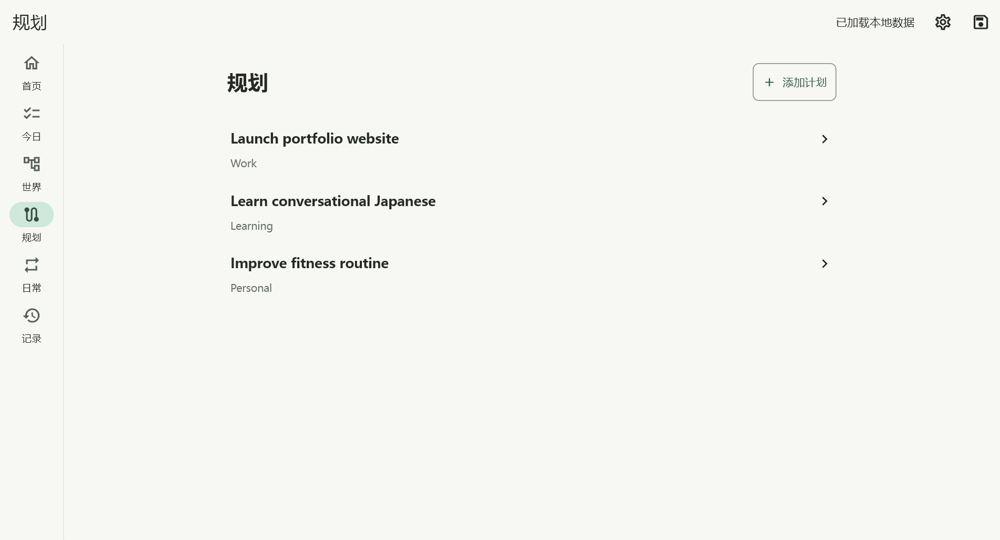
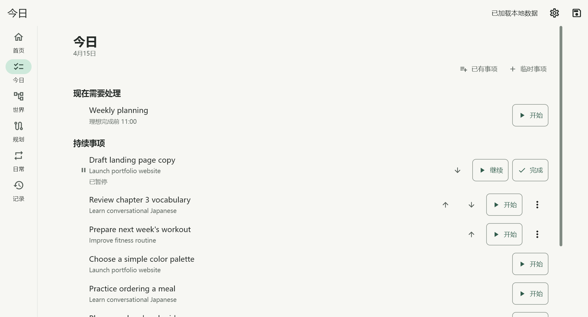
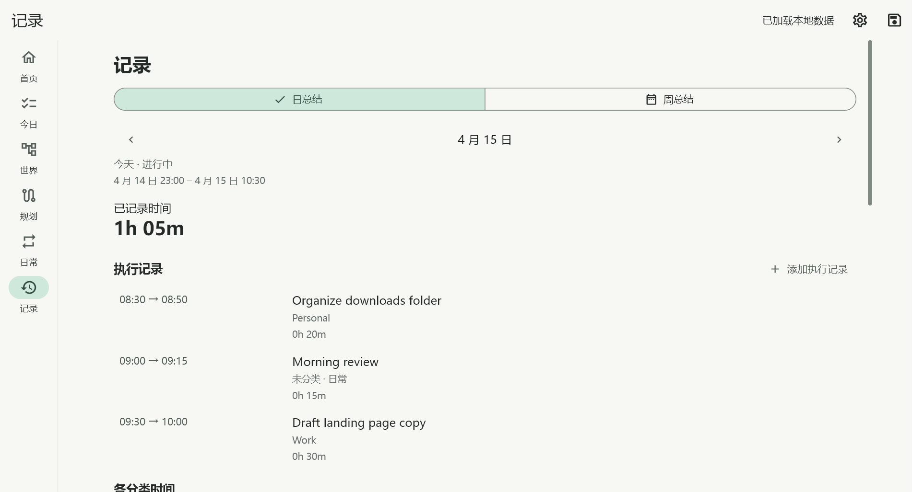

# Jax

Jax is a local-first personal planning, execution, and life-management app for
Windows and Android. It helps turn long-term intentions into plans, today's
actions, execution records, and review.

**Initial public source release · active development · 0.1.0+1.** Prebuilt releases are
not published yet; build from source. The current application interface is Chinese.

## Why Jax

A plan and a record answer different questions. Jax connects them without making
an intention, a next step, and elapsed work the same thing:

**Intent → Planning → Today → Execution → Record → Review → Adjustment**

| Space | Purpose |
|---|---|
| World | Organize long-term intentions in a hierarchy |
| Planning | Work through steps and successive planning rounds |
| Today | See what needs attention now |
| Home | Enter a contextual “what next?” workflow |
| Record | See what actually happened |

## A look inside

These are real Windows app views with entirely fictional data and a fixed demo
clock. Labels retain the current Chinese UI. [Reproduce the screenshots](docs/SCREENSHOTS.md).

| Home | Planning |
|---|---|
|  |  |
| Today | Record |
|  |  |

## Features

- World hierarchy, focused nodes, planning rounds and executable PlanItems.
- Dynamic Today, scheduled and on-demand Routines, temporal routine windows.
- Start, pause, wait and resume execution; RunSegments record active time.
- Execution correction, records and planning review notes.
- A configurable assistant name (default: **Butler**).
- Shared Windows/Android core logic and local SQLite storage.

Home uses current execution state, routine timing and focused categories for
**rule-based temporal recommendations**. It is not an AI recommendation service.

## Architecture and stack

Flutter and Dart provide the UI and domain logic; SQLite repositories store data.
The runtime path is UI → Core/Domain → Data/Repository → SQLite; dependency
interfaces keep **UI → Core ← Data**. Windows and Android share core/data logic,
with platform-specific runtime integration where needed. Developer tools use
Dart and PowerShell; GitHub Actions configuration supplies routine CI gates.

See [Architecture](docs/ARCHITECTURE.md), [Data model](docs/DATA_MODEL.md) and
[Design notes and validation status](docs/DESIGN.md).

## Build from source

Use **Flutter 3.47.1** with its bundled **Dart 3.13.1**. The tested full host-test
workflow runs on Windows because the SQLite native hook uses `winsqlite3`.
Install the Android SDK/JDK for Android and Visual Studio's C++ workload for Windows.

```sh
flutter pub get
flutter test
flutter build apk --debug
flutter build windows --release
```

[Building Jax](docs/BUILDING.md) covers prerequisites and platform commands;
[reproducibility evidence](docs/REPRODUCIBILITY.md) states what was actually tested.
Android Release builds require locally configured signing credentials; see
[Release signing](docs/ANDROID_RELEASE_SIGNING.md). Debug APKs are development
artifacts, not public Release downloads.

## Testing

The public source checkout passed **698 Flutter tests** and `flutter analyze`.
Phase 6 separately verified Android native **8/8**, Windows native **7/7**, and
tool contracts **7/7**. These are verification counts, not coverage claims.
[Publication checklist](docs/PUBLICATION_CHECKLIST.md) records the publication checks.

GitHub-hosted CI has passed analysis, host tests, Android Debug and Windows Release
builds. See the [verified public run](https://github.com/JarrettKang/Jax/actions/runs/35491066377)
and [current CI runs](https://github.com/JarrettKang/Jax/actions/workflows/ci.yml).
Native matrices are separate release verification. Android integration-test
harness instability was observed; independent SQLite smoke tests and subsequent
native verification passed. See the reproducibility report for the boundary.

## Sync and limitations

Current Sync is an **experimental, developer-oriented Windows ↔ Android ADB
workflow**: snapshot, baseline, compare, conflict detection, apply and rollback.
Read [developer tool safety](docs/TOOLS.md) before using it with data.

Jax stores application data locally in SQLite. **Database contents are not
encrypted at rest by Jax.** There is no cloud, LAN or automatic background sync,
no collaboration, and no dark mode. Public installer/store distribution is not
yet established. This is an early project, not a stable production release.

## Development and AI assistance

Jax is designed and maintained by Jarrett. Product direction, requirements,
architecture decisions, validation and maintenance are led by Jarrett. The project
uses OpenAI Codex extensively as an AI-assisted development tool for implementation,
testing, refactoring and release preparation.

## Contributing and security

Contributions and issue reports are welcome. Read [CONTRIBUTING](CONTRIBUTING.md)
and use synthetic data in reports and fixtures. Sensitive vulnerabilities should
follow [SECURITY](SECURITY.md), not public issues. No response-time SLA is promised.

## License

[MIT License](LICENSE), Copyright © 2026 Jarrett. The original Jax J icon and
project-created screenshots are covered by the project license.
